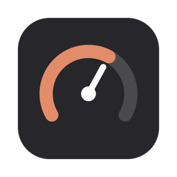

<p align="center"></p>

<h1 align="center">Claudometer</h1>

<p align="center"><b>Your Claude Code plan usage, always visible in the macOS menu bar.</b></p>

<p align="center"><code>5h 46% · 7d 12%</code></p>

Claudometer tracks the 5-hour and 7-day rate-limit windows of your Claude
account, warns you before you hit a limit, and tells you the moment a
saturated quota frees up. No login, no configuration: if Claude Code works in
your terminal, Claudometer works in your menu bar.

## Install

1. Download `Claudometer-x.y.z.zip` from the
   [latest release](https://github.com/jbouchery/claudometer/releases/latest)
   and unzip it.
2. Move `Claudometer.app` to `/Applications`.
3. **First launch: right-click `Claudometer.app` → Open → Open.**


> ⚠️ Step 3 is not optional. The app is not notarized by Apple, so a normal
> double-click shows *"Claudometer can't be opened"* with no way forward.
> Right-click → Open (needed once) is what unlocks it. Terminal alternative:
> `xattr -d com.apple.quarantine /Applications/Claudometer.app`

That's it — the gauge appears in your menu bar, already tracking whichever
account is logged in to Claude Code. Optional: tick "Launch at Login" in the
menu.

Requires macOS 13+ and a logged-in Claude Code CLI.

<details>
<summary><b>Install from source</b></summary>

Requires Xcode Command Line Tools (Swift 5.9+).

```sh
./scripts/build-app.sh          # builds, signs (ad-hoc), zips
cp -R Claudometer.app /Applications/
open /Applications/Claudometer.app
```

Install to `/Applications` before enabling Launch at Login: macOS registers
the app by path, and the copy inside the repo is destroyed and rebuilt by
every `build-app.sh` run.

</details>

## What you get

- **Live usage at a glance** — both rate-limit windows in the menu bar,
  refreshed every 60s; details (reset times, account) one click away.
- **Configurable display** (menu → Display) — one window or both, names and
  `%` optional, down to a minimal `46`.
- **Alerts** — native notifications when a window crosses 90%, and when a
  saturated quota resets. Quiet by design: no stale 3am notifications.
- **Follows your account** — `/login` switches are picked up instantly.
- **Honest when data ages** — a stale number shows its age (`(23m)`) instead
  of pretending to be live.
- **Update notice** — checks the latest release daily; updating stays a
  two-click affair.
- **Read-only by design** — never logs in, never refreshes or writes tokens,
  never stores anything sensitive.

Want the details — architecture, what the app never does, and its known
limits? Read **[docs/how-it-works.md](docs/how-it-works.md)**.

## License

MIT, see [LICENSE](LICENSE).
