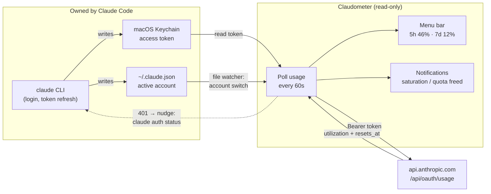

# Claudometer

A tiny macOS menu bar app that keeps an eye on your Claude Code plan usage —
the 5-hour and 7-day rate-limit windows — so you know where you stand before
you hit a limit, and get told the moment a saturated quota frees up.

```
5h 46% · 7d 12%
```

No login, no configuration, no account setup: if Claude Code works in your
terminal, Claudometer works in your menu bar.

## Features

### Live usage at a glance

The menu bar shows both rate-limit windows permanently: `5h 46% · 7d 12%`.
Numbers refresh every 60 seconds. Open the menu for details — exact
percentages, when each window resets, and which account is being tracked.

### Follows your active account

Switch accounts with `/login` in any terminal and Claudometer follows
instantly — it watches Claude Code's config file for changes, no polling, no
restart. Each account keeps its own remembered state, so switching back shows
correct numbers immediately.

### Alerts

Native macOS notifications, no setup:

- **Saturation** — a window crosses 90%: time to think about pacing or
  switching accounts. Fires once, re-arms only after usage drops back down.
- **Quota freed** — a window that was ≥ 80% just reset: you're good to go
  again. Precise to the second: Claudometer schedules the notification on the
  known reset time instead of waiting for the next poll.

Notifications are deliberately quiet: nothing fires for resets that happened
while your Mac was asleep or hours ago — stale news is no news.

### Honest when data ages

Claude Code's session token expires after a few hours without activity.
Claudometer never refreshes it (see below), so when the token is stale it
shows the last known value with its age instead of an error:

```
5h 46% · 7d 12% (23m)
```

The `(23m)` tells you how old the number is. Stale doesn't mean useless — if
this machine is your only Claude surface, usage barely moves while you're
idle. But quotas are account-wide (claude.ai, mobile, another machine), and a
reset can happen while you're away, so Claudometer also tries to shorten
these stale periods: on an expired token it nudges Claude Code's own auth
machinery (`claude auth status` — 0.2s, no quota consumed) to trigger a
legitimate refresh, then polls again. The moment a fresh token exists, live
numbers are back.

### Missed-reset reconciliation

Quota reset at 3am while the lid was closed? On wake, the display updates
silently — no avalanche of outdated notifications after a weekend away.

## Install

Requires macOS 13+ and Xcode Command Line Tools (Swift 5.9+) to build.

```sh
./scripts/build-app.sh
open Claudometer.app
```

First launch of an unsigned app: right-click → Open (once), or
`xattr -d com.apple.quarantine Claudometer.app`.

For development, `swift run Claudometer` works too (notifications are
disabled outside a proper .app bundle). `swift run EvaluateCheck` runs the
logic self-checks.

## How it works — and what it never does

Claude Code keeps an OAuth session in the macOS Keychain (service
`Claude Code-credentials`) and the active account's profile in
`~/.claude.json`. Claudometer **reads** both, and that's the whole story:



The one dashed arrow is the only thing Claudometer ever "does" to Claude
Code: on an expired token it runs `claude auth status`, so any refresh (and
the token rotation that comes with it) is performed by Claude Code itself.

- **Never runs a login flow** — no credentials asked, no OAuth client of its
  own.
- **Never refreshes or writes tokens** — Anthropic rotates refresh tokens, so
  a refresh from a second client would log Claude Code itself out. Token
  refresh is Claude Code's job; at most Claudometer asks it to do that job
  via `claude auth status`.
- **Never stores anything sensitive** — only last-seen usage percentages and
  reset times, in the app's own UserDefaults.
- **Single account by design** — it tracks whichever account is active in
  Claude Code. Multi-account monitoring would require Claudometer to hold its
  own tokens, which Anthropic's credential-use policy prohibits for
  third-party tools.

Usage numbers come from `https://api.anthropic.com/api/oauth/usage`, the same
endpoint the `claude` CLI calls internally. This is an undocumented,
reverse-engineered API — Anthropic could change or remove it at any time.

## Limitations, stated plainly

- Numbers refresh live only while a fresh Claude Code token exists. Idle for
  hours → last known value with its age; usage from other surfaces
  (claude.ai, mobile, another machine) is invisible during that gap. The
  `claude auth status` nudge shortens these gaps but depends on the CLI
  agreeing to refresh.
- One account at a time — the one active in your terminal.
- Unofficial API: a breaking change on Anthropic's side breaks the meter
  until updated.

## License

MIT, see [LICENSE](LICENSE).
