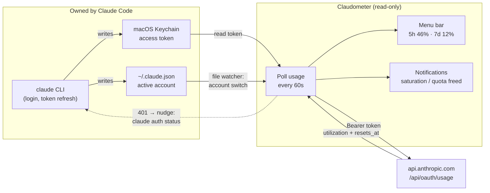

# How Claudometer works

Claude Code keeps an OAuth session in the macOS Keychain (service
`Claude Code-credentials`) and the active account's profile in
`~/.claude.json`. Claudometer **reads** both, and that's the whole story:



The one dashed arrow is the only thing Claudometer ever "does" to Claude
Code: on an expired token it runs `claude auth status`, so any refresh (and
the token rotation that comes with it) is performed by Claude Code itself.

## What it never does

- **Never runs a login flow** — no credentials asked, no OAuth client of its
  own.
- **Never refreshes or writes tokens** — Anthropic rotates refresh tokens, so
  a refresh from a second client would log Claude Code itself out. Token
  refresh is Claude Code's job; at most Claudometer asks it to do that job
  via `claude auth status`.
- **Never stores anything sensitive** — only last-seen usage percentages and
  reset times, in the app's own UserDefaults.
- **Single account by design** — it tracks whichever account is active in
  Claude Code. Multi-account monitoring would require Claudometer to hold its
  own tokens, which Anthropic's credential-use policy prohibits for
  third-party tools.

Usage numbers come from `https://api.anthropic.com/api/oauth/usage`, the same
endpoint the `claude` CLI calls internally. This is an undocumented,
reverse-engineered API — Anthropic could change or remove it at any time.

## Features in detail

### Live usage and configurable display

The menu bar shows the rate-limit windows permanently, refreshed every 60
seconds. The menu shows exact percentages, reset times, and the tracked
account.

The display is configurable (menu → Display): show one window or both
(`5h and 7d` / `5h only` / `7d only`), with or without window names, with or
without the `%` symbol — down to a minimal `46`. A `!` marks a saturated
window in every format, and a hidden window forces its way back into the menu
bar (with its name) when it saturates, so you can't miss it.

The reset countdown can be shown next to each window ("Time until reset"):
as remaining time (`5h:46%→2h13m`) or as the reset's clock time
(`5h:46%→Fri 19:59`). The menu details always show both the reset time and
the remaining time.

### Follows your active account

Switch accounts with `/login` in any terminal and Claudometer follows
instantly — it watches `~/.claude.json` with a file-system event (no
polling). Each account keeps its own remembered state, so switching back
shows correct numbers immediately.

### Alerts

Native macOS notifications, no setup:

- **Saturation** — a window crosses 90%: time to think about pacing or
  switching accounts. Fires once, re-arms only after usage drops back down.
- **Quota freed** — a window that was ≥ 80% just reset: you're good to go
  again, whether that's the scheduled 5h/7d rollover or Anthropic resetting it
  early (goodwill/incident resets) -- treated the same either way. Precise to
  the second: Claudometer schedules the notification on the known reset time
  instead of waiting for the next poll.

Notifications are deliberately quiet: nothing fires for resets that happened
while your Mac was asleep or hours ago — stale news is no news. On wake, the
display reconciles silently.

Help → "Send Test Notification" verifies the notification pipeline end to
end (permission + banner display) without waiting for a real alert.

### Honest when data ages

Claude Code's session token expires after a few hours without activity.
Claudometer never refreshes it (see above), so when the token is stale it
shows the last known value with its age instead of an error:

```
5h 46% · 7d 12% (23m)
```

The `(23m)` tells you how old the number is. Stale doesn't mean useless — if
this machine is your only Claude surface, usage barely moves while you're
idle. But quotas are account-wide (claude.ai, mobile, another machine), and a
reset can happen while you're away, so Claudometer also tries to shorten
these stale periods: on an expired token it nudges Claude Code's own auth
machinery (`claude auth status` — 0.2s, no quota consumed) to trigger a
legitimate refresh, then polls again. The moment a fresh token exists, live
numbers are back.

### Update notice

Once a day Claudometer checks the latest GitHub release (public API, no
tracking) and shows an "Update available" menu item linking to the release
page when a newer version exists. No auto-update — an unsigned app can't
replace itself gracefully, so updating stays a two-click affair. The Help
submenu shows the current version and offers a manual check.

### Launch at Login

Native `SMAppService` — the app also shows up in System Settings → General →
Login Items, so you stay in control.

## Limitations, stated plainly

- Numbers refresh live only while a fresh Claude Code token exists. Idle for
  hours → last known value with its age; usage from other surfaces
  (claude.ai, mobile, another machine) is invisible during that gap. The
  `claude auth status` nudge shortens these gaps but depends on the CLI
  agreeing to refresh.
- One account at a time — the one active in your terminal.
- Unofficial API: a breaking change on Anthropic's side breaks the meter
  until updated.

## Development

```sh
swift run Claudometer      # run without a bundle (notifications and the
                           # login item are disabled outside a .app)
swift run EvaluateCheck    # assert-based self-checks of the decision logic
```

The decision logic (thresholds, alert rules, staleness) lives in the
`ClaudometerCore` library target as a pure function, exercised by
`Checks/EvaluateCheck`.
